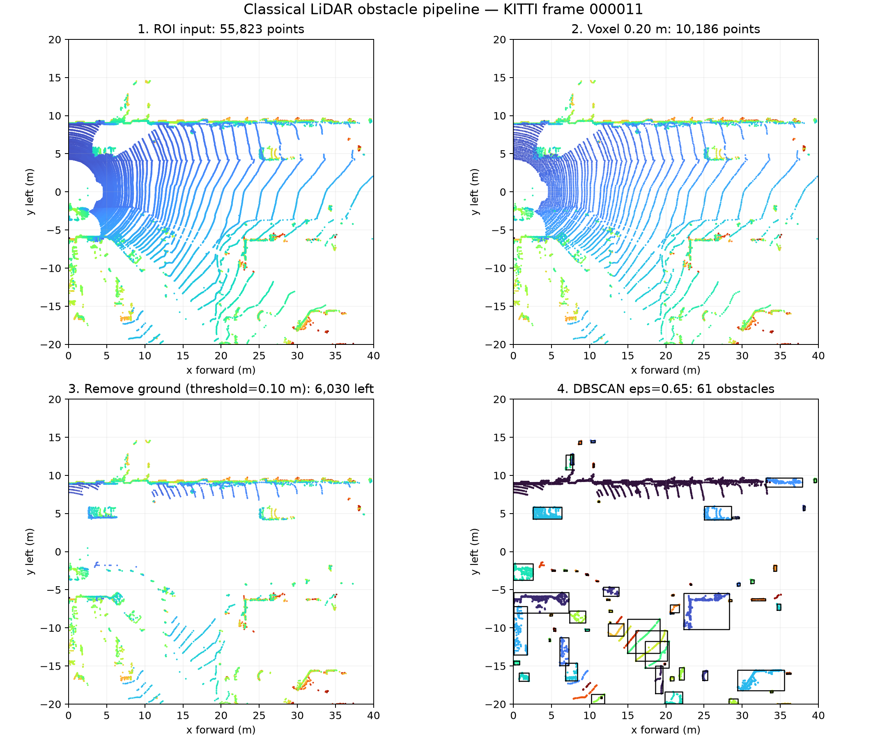
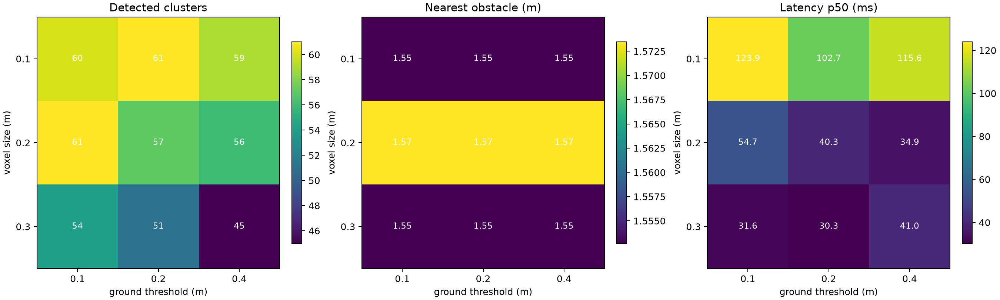
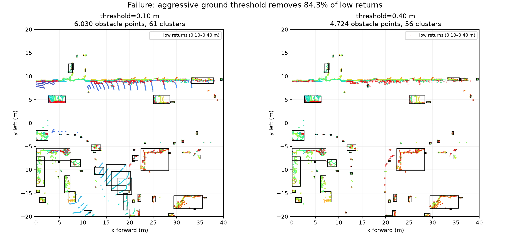

# Báo cáo Day 6: Phát hiện vật cản LiDAR cho robot bằng RANSAC và DBSCAN

- **Họ tên:** Đinh Quốc Bảo
- **MSSV:** 2A202602933
- **Lớp:** AI20K — Track 4
- **Link repo:** https://github.com/nova-io-vn/DinhQuocBao-2A202602933-Track4-Day21
- **Topic:** D — Phát hiện vật cản cho robot/drone
- **Dataset:** `data/kitti_mini`
- **Các frame đã dùng:** `000011`

## 1. Claim

Trên KITTI frame `000011`, tăng đồng thời voxel từ 0,10 m lên 0,30 m và ngưỡng tách đất từ 0,10 m lên 0,40 m làm p50 latency giảm từ 123,9 ms xuống 41,0 ms (nhanh hơn 3,0 lần), nhưng số cụm vật cản giảm từ 60 xuống 45. Ngưỡng mặt đất 0,40 m còn loại nhầm 84,3% điểm thấp 0,10–0,40 m so với mặt phẳng, nên cấu hình nhanh hơn không an toàn cho vật thấp sát sàn.

## 2. Evidence

Giữ cố định ROI 0–40 m phía trước, ±20 m ngang, `eps=0.65`, `min_points=6`, seed 42; mỗi latency được đo 21 lần sau một lần warm-up. Bảng đầy đủ 9 cấu hình nằm tại `results/obstacle_sweep.csv`.

| Voxel / ngưỡng đất (m) | Số điểm sau voxel | Số cluster | Vật gần nhất (m) | p50 / p95 (ms) |
|---|---:|---:|---:|---:|
| 0,10 / 0,10 | 21.584 | 60 | 1,55 | 123,9 / 178,3 |
| 0,20 / 0,20 | 10.186 | 57 | 1,57 | 40,3 / 46,5 |
| 0,30 / 0,40 | 6.206 | 45 | 1,55 | 41,0 / 95,9 |





Ảnh Advanced `results/figures/occupancy_grid.png` biểu diễn các điểm không phải mặt đất trên occupancy grid BEV 0,20 m/ô, kèm bounding box của từng cluster.

## 3. Failure case



Khi tăng `distance_threshold` từ 0,10 lên 0,40 m (các tham số khác giữ nguyên), 607/720 điểm thấp từng được giữ lại bị gán nhầm thành mặt đất: mất 84,3%; số cụm giảm từ 61 xuống 56 (`results/failure_metrics.csv`). Đây là lỗi **Preprocess**: ngưỡng khoảng cách tới mặt phẳng quá lớn nuốt các phản hồi của pallet, xe đẩy hoặc người ngồi. Khi chạy thật cần ghi log tỷ lệ ground/total, số điểm thấp còn lại và số cluster; cảnh báo khi chúng thay đổi đột ngột, đồng thời dùng ground model thích nghi theo độ dốc thay vì một ngưỡng lớn cố định.

## 4. Khuyến nghị nếu triển khai thật

Với robot kho chạy chậm, chọn voxel 0,20 m và ngưỡng đất 0,10 m để ưu tiên giữ vật thấp; không dùng ngưỡng 0,40 m dù giảm số điểm xử lý. Chạy pipeline trong ROI theo hành lang di chuyển, kết hợp occupancy grid nhiều frame và vùng an toàn theo tốc độ robot. Cần log p50/p95 latency, tỷ lệ điểm mặt đất, số cluster, khoảng cách vật gần nhất và độ nghiêng mặt phẳng; nếu p95 vượt chu kỳ điều khiển hoặc chỉ số điểm thấp tụt mạnh thì giảm tốc/dừng an toàn.

## 5. Cách chạy lại

Từ thư mục gốc của repo, chạy các lệnh sau; lệnh thứ hai tái tạo `obstacle_sweep.csv`, `failure_metrics.csv` và toàn bộ bốn ảnh trong `results/figures/`.

```bash
python -m venv .venv
.venv\Scripts\python.exe -m pip install -r requirements.txt
.venv\Scripts\python.exe -m src.obstacle_pipeline
.venv\Scripts\python.exe tools/check_submission.py
```

## 6. Khai báo sử dụng AI

| Công cụ | Dùng cho việc gì | Bạn đã kiểm chứng thế nào |
|---|---|---|
| OpenAI Codex | Hỗ trợ đọc đề, viết pipeline/CLI, thiết kế benchmark, sinh biểu đồ và soạn báo cáo | Tôi chạy script trên dữ liệu KITTI thật, cố định seed 42, đo mỗi cấu hình 21 lần, kiểm tra trực quan tất cả ảnh và đối chiếu số trong REPORT với hai file CSV |
